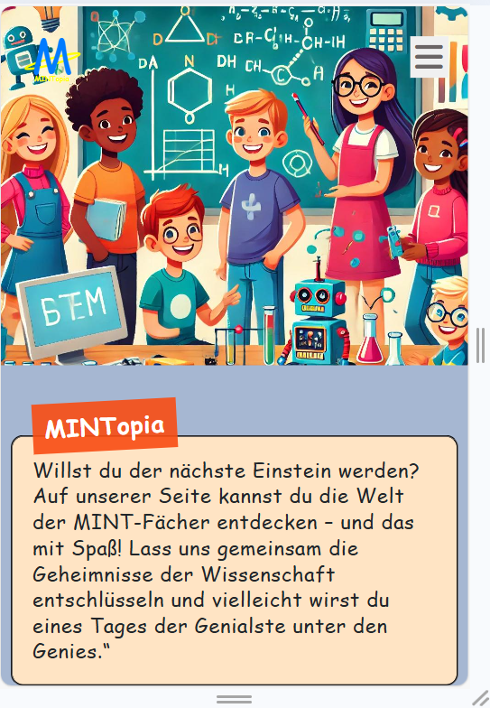
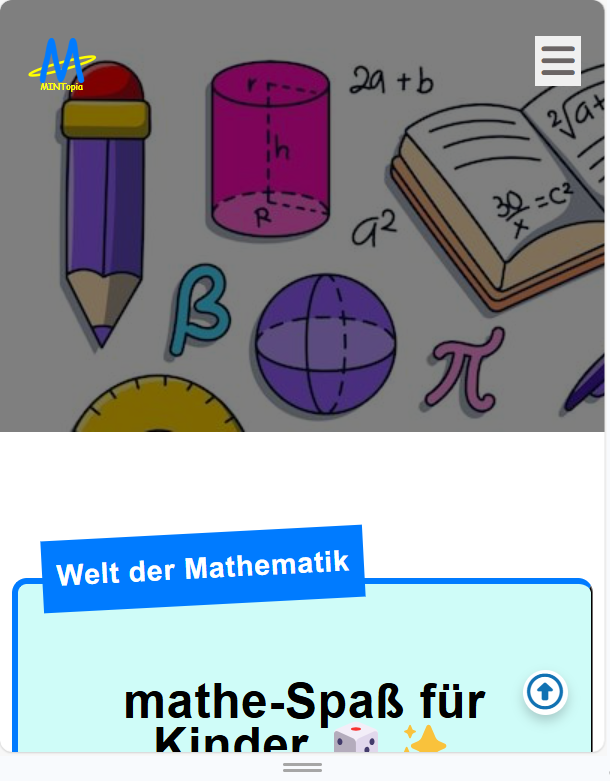
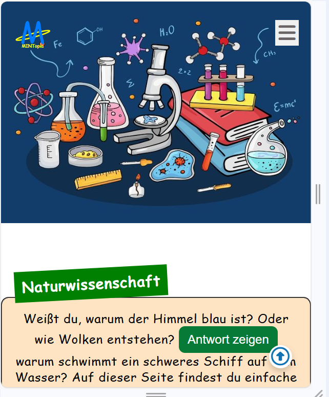
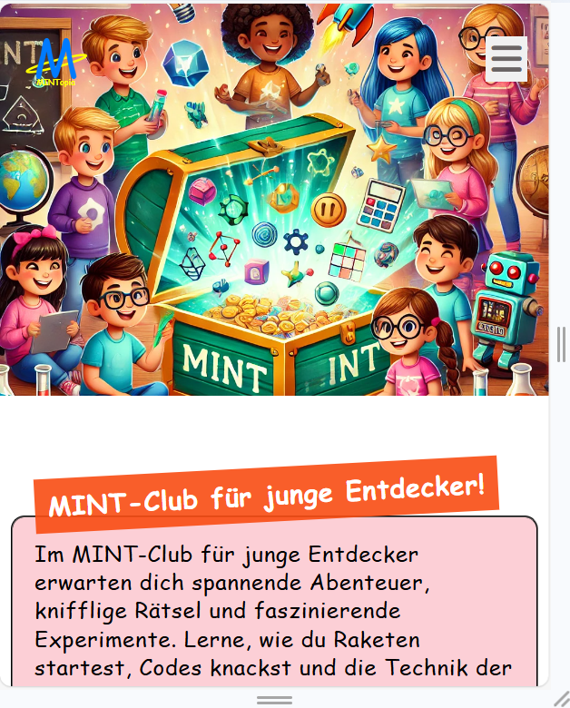

# WebEntwicklung_projekt
Website für die Zielgruppe"Grundschueler" entwickeln , auf welche Begeisterung für MINT vermittelt werden soll
!(https://github.com/0xSharlyne/Mintopia.github.io)

## Anforderungen

1. **Einzelseiten**  
   Die Webseite besteht aus mindestens vier individuellen Einzelseiten, die über ein Navigationsmenü miteinander verbunden sind. Jede Seite bietet Inhalte mit Mehrwert für den Besucher. 

2. **Multimediale und interaktive Gestaltung**  
   Mehrere Seiten der Webseite sind multimedial und/oder interaktiv gestaltet, um die Benutzererfahrung zu verbessern.

3. **Responsives Design**  
   - Alle Seiten der Webseite sind responsiv und rendern anschaulich sowie funktionell auf Geräten mit Viewports zwischen **375 x 667 px** und **1920 x 1980 px**.  
   - Die Webseite wurde mit einem **mobile-first Ansatz** konzipiert.

4. **Verwendung von CSS Grid und Flexbox**  
   - Das Layout der gesamten Webseite basiert auf **CSS Grid**, um ein flexibles und responsives Design zu gewährleisten.  
   - Für die Gestaltung der Navigationsleiste wurde **CSS Flexbox** verwendet.  
   - Weitere ein- und zweidimensionale Elemente wurden nach Bedarf mit CSS Grid und Flexbox gestaltet.  
   - Die Verwendung von float-Layouts und dem CSS Box-Modell wurde vermieden

## Technologien

- **HTML5**: Für die Struktur der Webseite.  
- **CSS3**: Für das Styling, einschließlich CSS Grid und Flexbox für das Layout und die Navigation.  
- **JavaScript**: Für interaktive und dynamische Inhalte. 

## Seitenübersicht

### Home Page 

---

### Mathe Seite 

---

### Info Seite

---

### Naturwissenschaft Seite

---

### Join Seite 

